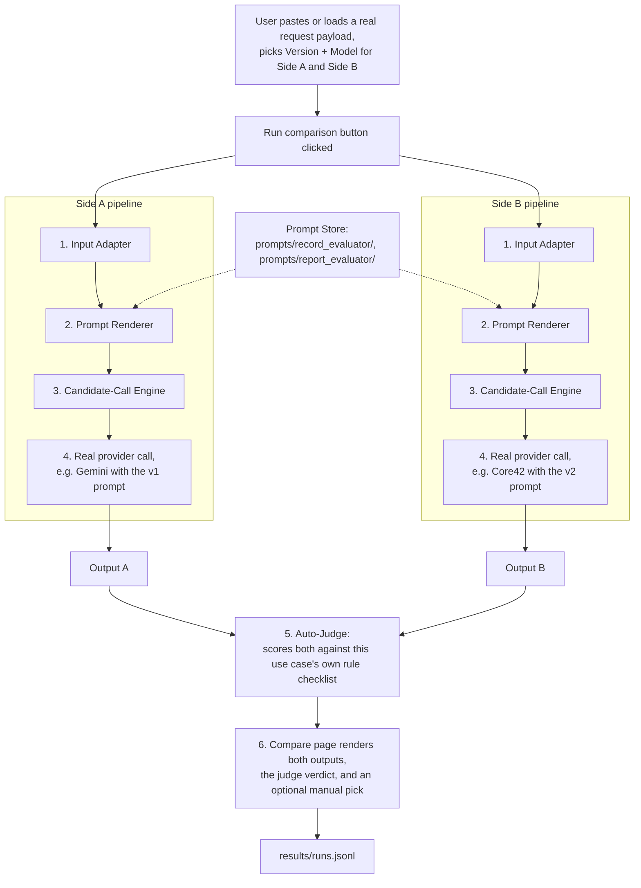

# Prompt Lab — Architecture & Implementation Overview

**What it is:** a standalone tool for comparing Medals-AI prompt versions — manually, side by side, and automatically via an LLM judge — without touching the Medals-AI repo or its deployment.

**Status:** functional and verified end-to-end with real model calls (Gemini and Core42). Covers 2 of Medals-AI's 6 use cases (Record Evaluator, Report Evaluator); built to extend to the rest.

---

## 1. Problem this solves

Medals-AI currently has two live prompt generations for its Azure Functions backend:
- **v1** — `azure-functions/`
- **v2** — `azure-functions-unified/` (adds Core42 as a provider, updated prompt wording)

Testing which version actually performs better required editing prompt code directly in the Medals-AI repo, redeploying, and running a full pipeline per version — slow, and it conflates *prompt quality* with *which model/infra happened to be deployed*.

Prompt Lab removes the redeploy step entirely: prompt text lives in versioned files, a local runner calls the real LLM providers with production-identical parameters, and comparisons happen interactively in a few seconds.

---

## 2. Architecture

The core idea: **one input, two independent pipelines (Side A / Side B), one judge.** Each side can independently pick a prompt version *and* a model, so the tool can answer "is v2 better than v1?", "is Gemini better than Core42 for this prompt?", or both at once.



*(Boxes are grouped by file in the component table below — `1. Input Adapter` = `runner/input_adapters.py`, `2. Prompt Renderer` = `runner/prompt_loader.py`, `3. Candidate-Call Engine` = `runner/engine.py`, `5. Auto-Judge` = `runner/judge.py`.)*

**Step by step, what happens on one click of "Run comparison":**

1. **Input Adapter** takes the pasted request payload (shaped exactly like the real Medals-AI API body — same JSON a caller would send to the Azure Function) and extracts the variables each prompt template actually needs. For Report Evaluator this includes replicating production's own pillar-grouping logic (splitting criterion names like `"Performance - Key Achievements"` on `" - "`) and building the `subdimensions_text` block exactly as the real code does.
2. **Prompt Renderer** pulls the chosen version's prompt text from the **Prompt Store** and substitutes those variables in. For Report Evaluator this also means assembling the right fragments — the main body, plus the conditional Learning & Development block *only* when the pillar name matches, plus the shared tail.
3. **Candidate-Call Engine** sends the rendered prompt to the real provider using the exact parameters production uses for that (use case, version, provider) combination — temperature, JSON-mode mechanism, token limits — documented in `schemas/SCHEMAS.md`. It retries the same model once or twice on a parse failure, but never silently swaps to a different model.
4. This repeats independently for Side A and Side B — they can differ in version, in model, or both.
5. Once **both** sides succeed, the **Auto-Judge** automatically scores each output against that use case's own rule checklist (the same rules already embedded in the prompt itself — see `judge_criteria.yaml`) and produces per-criterion scores, an overall score for each side, and a written recommendation. This happens automatically, with no extra click.
6. The Compare page renders both outputs, the judge's verdict, and (optionally) a manual human pick — the manual pick and the judge verdict are logged together to `results/runs.jsonl`.

---

## 3. Example: what one comparison run actually produces

This is a real payload and real output, captured from an actual run against live Gemini and Core42 API calls.

**Input** (Record Evaluator, matching the real API request shape):
```json
{
  "content": {
    "الإنجاز": "طوّرت نظام حجز مواعيد إلكتروني قلل وقت الانتظار بنسبة 45%",
    "التأثير": "تحسين تجربة المرضى وتقليل الازدحام في العيادة"
  },
  "rubric_data": {
    "rubric_type": "الإنجاز والتأثير",
    "criteria": "الأداء (35%)، المساهمات (30%)، النمو (20%)، الانفتاح (15%)"
  },
  "record_id": "rec_00123"
}
```

**Side A** (v1, Gemini Flash) — excerpt of the actual strengths returned:
> أظهر المرشح كفاءة عالية في الأداء من خلال تطوير نظام حجز مواعيد إلكتروني، مما يعكس قدرته على الابتكار التقني وتقديم حلول عملية للمشاكل التشغيلية.

**Side B** (v2, Gemini Flash) — excerpt of the actual strengths returned:
> أظهر المرشح قدرة مميزة في الأداء من خلال تطوير نظام حجز مواعيد إلكتروني، مما يعكس مبادرة استراتيجية لتبني الحلول الرقمية في إدارة العمليات وتعزيز الكفاءة التشغيلية.

(Each side's full output has 3 strengths, 3 areas for improvement, and 3 recommendations, in both Arabic and English.)

**Auto-Judge verdict** — illustrative shape (field names are exact; scores below are for illustration, not a captured transcript):
```json
{
  "criterion_scores": [
    {"criterion": "concrete_anchor", "score_a": 8, "score_b": 7, "notes": "Both anchor to the same 45% figure; A ties it more explicitly to a named performance criterion."},
    {"criterion": "grounding", "score_a": 9, "score_b": 9, "notes": "Neither output invents facts beyond the input."}
  ],
  "overall_score_a": 82,
  "overall_score_b": 78,
  "winner": "A",
  "recommendation": "Side A scores slightly higher on concrete anchoring of the quantitative claim to a specific performance criterion, while both outputs are equally well-grounded in the source content."
}
```

---

## 4. Components

| Component | Path | Responsibility |
|---|---|---|
| Prompt store | `prompts/{use_case}/` | Versioned prompt text, extracted verbatim from Medals-AI's own code |
| Judge criteria | `prompts/{use_case}/judge_criteria.yaml` | Scoring rubric per use case, derived directly from each prompt's own embedded rule checklist (banned phrases, grounding rules, JSON schema, etc.) — not invented separately |
| Schemas reference | `schemas/SCHEMAS.md` | Exact request/response schemas and per-provider call parameters (temperature, JSON-mode mechanism, token limits, retry/fallback behavior), verified directly against Medals-AI's `core/evaluator.py` source |
| Input adapters | `runner/input_adapters.py` | Turn a real request payload into prompt-template variables — replicates production's pillar-grouping logic (splitting `"MainCriterion - SubDimension"` names) and `subdimensions_text` formatting exactly |
| Prompt loader/renderer | `runner/prompt_loader.py` | Assembles Report Evaluator's multi-fragment prompts (main body + conditional Learning & Development block + shared tail) and renders template variables |
| Candidate-call engine | `runner/engine.py` | Calls the real provider (Gemini / Claude / GPT-4o / Core42) with production-identical parameters; retries the same model on parse failure |
| Response models | `runner/models.py` | Pydantic models mirroring the real response shapes, including Gemini's exact structured-output schema (`get_genai_schema()`) |
| Auto-judge | `runner/judge.py`, `runner/judge_models.py` | Scores both outputs against the use case's criteria and produces a recommendation, automatically, right after both sides complete |
| Streamlit UI | `streamlit_app.py`, `app_pages/compare.py` | The Compare page — input, side-by-side run, rendered results, auto-judge verdict, manual pick |
| Render helpers | `render_helpers.py` | Shared card renderers for record/report-pillar/executive-summary outputs and the judge verdict scorecard |
| Results log | `results/logger.py`, `results/runs.jsonl` | Append-only JSON-lines log of every comparison, including the judge's verdict and any manual pick |
| Sample payloads | `sample_payloads.py` | Realistic example requests for each use case, used by the Compare page's "Load sample" buttons and by the headless smoke test |
| Headless smoke test | `test_engine.py` | Validates prompt assembly and input adaptation without a browser or API keys (`--live` mode additionally fires one real call per configured provider) |

---

## 5. Key design decisions

**Fidelity to production over convenience.** The entire point of this tool is a valid apples-to-apples comparison. Call parameters (temperature, JSON-mode mechanism, token limits), retry behavior, and even known quirks in the real code (e.g., v1 Report Evaluator's Claude/GPT-4o path receives *no* explicit JSON-format instructions in its prompt, unlike Gemini which gets a native structured-output schema) are reproduced exactly rather than silently "improved." A discovered bug is fixed to *match production*, never to make the tool's output look better than production actually behaves.

**No generic LLM framework on the candidate-call path.** The runner intentionally does not use an abstraction like LangChain to call the model under test — a framework can silently change how JSON mode or system prompts are constructed per provider, which would undermine the comparison. Direct provider SDK calls, parameterized exactly per `schemas/SCHEMAS.md`, are used instead.

**No cross-provider auto-fallback.** Production has fallback chains (e.g., v1 Record Evaluator tries `gemini_pro → gemini_flash → claude_sonnet`; v2's Core42 falls back to a secondary deployment). The runner deliberately does not replicate this: silently substituting a different model on failure would confound "which prompt is better" with "which model happened to answer." Same-model retry on parse failure is kept (a real per-prompt reliability signal); a failure after retries is surfaced as a first-class result rather than papered over.

**Judge model fixed to Core42 GPT-5.1**, falling back to another configured model only if that's unavailable in the current environment. This keeps judging consistent across runs rather than varying by whatever happens to be configured.

**Single-pass judging**, not a double-order-swap (re-running with A/B order flipped to catch position bias). Chosen for speed — the judge needs to feel instant, running inline on every comparison — at the cost of not fully ruling out position bias. Worth revisiting if verdicts start looking order-sensitive in practice (e.g., if "Side A" wins suspiciously often regardless of content).

**Fully independent of the Medals-AI deployment.** No imports from the Medals-AI repo; prompt text is copied out and versioned here so new draft prompts can be tested without touching Medals-AI's code or Azure Functions at all.

---

## 6. Verification performed

This wasn't built and assumed to work — each layer was checked against something concrete:

- **Prompt text accuracy:** every prompt fragment was cross-checked against the actual `core/evaluator.py` source in the relevant Medals-AI branch (`main` for v1, `origin/core42-tests` for v2), not against documentation, which was found to be stale in places.
- **A real provenance discrepancy was found and documented, not silently resolved:** `PROMPT_INVENTORY.md`'s "v1" text for Record Evaluator matches the `core42-tests` branch's version of `azure-functions/`, not what's currently on `main` (which has an older, simpler prompt). This is called out explicitly in `schemas/SCHEMAS.md` rather than picked silently.
- **A real rendering bug was found and fixed:** naively formatting the fully-assembled Report Evaluator prompt crashed on v2's shared tail, which contains a literal JSON example with unescaped braces. Root cause: production's own code only wraps the prompt's main body in an f-string; the trailing sections are appended as plain (non-f) strings. Fixed to match that exact structure rather than altering the prompt text.
- **End-to-end live test:** with real API keys configured, `test_engine.py --live` and a full browser-driven run both completed successfully against real Gemini (`gemini_flash`, `gemini_pro`) and real Core42 (`gpt-5.1`, `gpt-4.1`, fallback) endpoints — confirmed real Arabic/English output, correct latency/attempt reporting, and a logged entry in `results/runs.jsonl`.
- **Graceful failure handling verified in-browser:** switching a side's model list out from under a stale selection (e.g. v1→v2 with `claude_sonnet` selected) does not crash — Streamlit resets to the first valid option. Running with no API keys configured shows a clear per-side error instead of an exception page.

---

## 7. Current scope

| Use case | Status |
|---|---|
| Record Evaluator | ✅ Full support — Compare + Auto-Judge |
| Report Evaluator (pillar evaluation) | ✅ Full support — Compare + Auto-Judge, including the conditional Learning & Development block |
| Report Evaluator (executive summary) | ✅ Compare only — no judge criteria defined yet for this prompt part |
| Attempt Comparator | ⬜ Not yet built |
| Pillar Summarizer | ⬜ Not yet built |

---

## 8. Extending Prompt Lab to a new use case

The pattern is the same one already used for the two existing use cases:

1. **Extract prompt text.** Pull the exact v1 and v2 prompt strings from the relevant Medals-AI `core/evaluator.py`, verifying against the actual source (not README docs, which have been found to be stale). Save as `prompts/{use_case}/v1.txt`, `v2.txt` (split into fragments if the real code assembles the prompt conditionally, as Report Evaluator does).
2. **Document exact call parameters** in `schemas/SCHEMAS.md` — temperature, JSON-mode mechanism, token limits, retry/fallback behavior, per provider and version.
3. **Write an input adapter** in `runner/input_adapters.py` that turns a real request payload into the exact variables the prompt template needs.
4. **Extend `runner/engine.py`** with a dispatcher function using the documented parameters for the new use case.
5. **Write `judge_criteria.yaml`** for the new use case, derived from that prompt's own embedded rule checklist.
6. **Wire it into `app_pages/compare.py`** — add it to the use-case selector, the `VALID_MODELS` table, and the judge-support check.

---

## 9. Running it

```bash
cd prompt-lab
pip install -r requirements.txt
cp .env.example .env        # fill in at least one provider's API key
streamlit run streamlit_app.py
```

`python test_engine.py` runs a headless dry-run smoke test of prompt assembly and input adaptation with no API keys required; `python test_engine.py --live` fires one real call per configured provider.

Without any keys configured, the Compare page is still fully usable for exploring the form and payload shapes — running a comparison shows a clear per-side "not configured" message instead of failing.

---

## 10. Security notes

- Real API keys live only in a local `.env` (never committed — see `.env.example` for the expected variable names, which match production's own env var names so real deployment values can be pasted in directly).
- `.gitignore` excludes `.env`, `.streamlit/secrets.toml`, and `results/runs.jsonl` (which may contain realistic test content) from the start — added before this project's first commit, so none of these have ever been in git history.
- No secrets or Medals-AI credentials are read from or written to the Medals-AI repo; Prompt Lab has no code dependency on Medals-AI at all.
- If API keys are ever shared in a chat, ticket, or transcript rather than only placed directly into `.env`, treat them as compromised and rotate them — this is a real risk this project's own investigation flagged in the main Medals-AI repo (committed Azure Function keys in `docs/postman/`).
